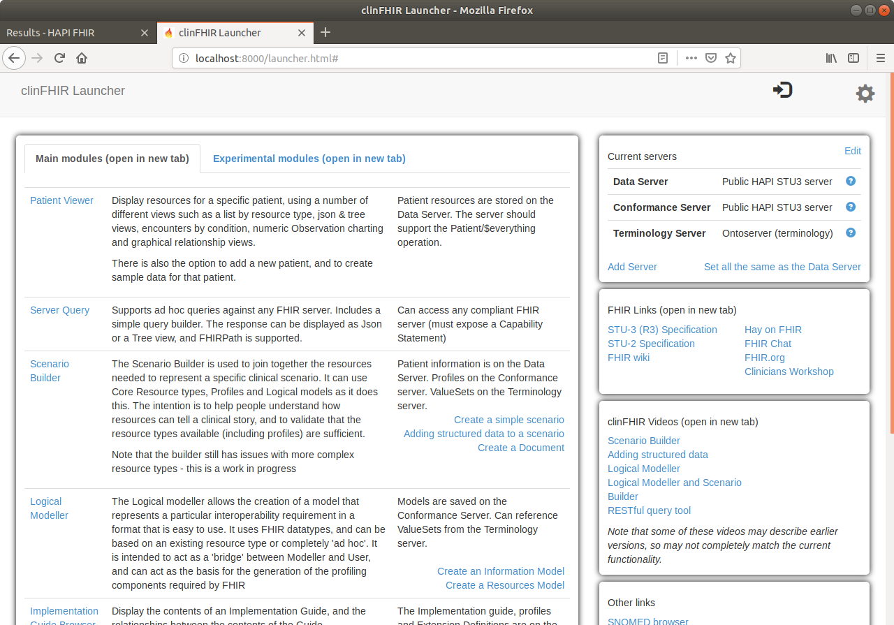

# CQL Sandbox (version 1)

This project creates a sandbox with open source tools that can support [Fast Healthcare Interoperability Resources (FHIR)](https://www.hl7.org/fhir/) and [Clinical Quality Language (CQL)](https://cql.hl7.org/) standards for developing and testing Clinical Decision Support (CDS) tools.

The sandbox will be a Linux Virtual Machine (VM) running on the Oracle VM VirtualBox and includes instances of the following:

1. **CQL Engines**
    - [DBCG/cql_execution_service](https://github.com/DBCG/cql_execution_service)
    - [AHRQ-CDS/AHRQ-CDS-Connect-CQL-SERVICES](https://github.com/AHRQ-CDS/AHRQ-CDS-Connect-CQL-SERVICES)
    - [cqframework/cql-execution](https://github.com/cqframework/cql-execution)
2. **FHIR Server** 
    - [Hapi-FHIR](http://hapifhir.io/)
3. **FHIR Profiling**
    - [clinFHIR](http://clinfhir.com/))


> Note: The instructions below are based on the original documentation of the services (see links above for the sources).

___
## Step 1: Create the CQL Sandbox VM

> Note: Skip this step if you already have a Linux system installed that is available for setup the CQL Sandbox.

In Oracle VirtualBox:

- Download Ubuntu Desktop 18.04
- Create a Linux VM: 
    - name: CQL Sandbox
    - memory: 2048
    - cpu: 1
    - Storage: 20GB
- Install Ubuntu (select default options)
    - username: cql
    - password: cql
- After Restart, Update the packages
    ```
    sudo apt update
    sudo apt dist-upgrade
    ```
- Restart

___
## Step 2: Install required packages

### Install java

```
sudo apt install openjdk-8-jdk
```

Check the path for the java install. 
```
sudo update-alternatives --config java
```

It should show `/usr/lib/jvm/java-8-openjdk-amd64/jre/bin/java`. If there are more Java options, select the option with `java-8-openjdk-amd64`.

Setup JAVA_HOME and PATH
```
sudo nano /etc/environment
```

Add the following content to the end of the file and save it.
```
JAVA_HOME="/usr/lib/jvm/java-8-openjdk-amd64"
PATH=${JAVA_HOME}/bin:${PATH}
export JAVA_HOME
export PATH
```

Setup the environment variables
```
source /etc/environment
```

Check the content of JAVA_HOME
```
echo $JAVA_HOME
```

It should show: `/usr/lib/jvm/java-8-openjdk-amd64`

### Install git, curl, maven, gradle and npm

```
sudo apt install git curl maven gradle npm
```

### Install yarn

```
curl -sS https://dl.yarnpkg.com/debian/pubkey.gpg | sudo apt-key add -
```

```
echo "deb https://dl.yarnpkg.com/debian/ stable main" | sudo tee /etc/apt/sources.list.d/yarn.list
```

```
sudo apt-get update && sudo apt-get install yarn
```

### Install coffeeScript

```
sudo npm install --global coffeescript
```

___
## Step 3: Install FHIR Server (HAPI-FHIR)

Download HAPI-FHIR version 3.6.0
```
wget https://github.com/jamesagnew/hapi-fhir/releases/download/v3.6.0/hapi-fhir-3.6.0-cli.zip
```

Create a folder to install HAPI-FHIR
```
mkdir ~/hapi
```

Extract the zip file to the new folder
```
unzip hapi-fhir-3.6.0-cli.zip -d ~/hapi
```

Start the HAPI-FHIR with FHIR DSTU2. For FHIR STU3 change the parameter `-v` to  `dstu3`. 
```
~/hapi/hapi-fhir-cli run-server -v dstu2 --allow-external-refs &
```

Open the internet browser and check if HAPI is running at `http://localhost:8080`. It will show `Software` = `HAPI FHIR Server - 3.6.0` and `FHIR Base` = `http://localhost:8080/baseDstu2/`.


### Add data examples to HAPI FHIR Server

Download the examples zip file.
```
wget http://build.fhir.org/examples-json.zip
```

Install the examples. Change the version and URL to `dstu3` as needed.

```
~/hapi/hapi-fhir-cli upload-examples -d examples-json.zip -t http://localhost:8080/baseDstu2 -v dstu2
```

Refresh the browser at `http://localhost:8080`. The number of resources will be updated. It might take a fee seconds to update.


### Upload Definitions

Upload StructureDefinition, ValueSet and CodeSystem definitions for the server to act as Conformance/Terminology server. Change the version and URL to `dstu3` as needed.
```
~/hapi/hapi-fhir-cli upload-definitions -t http://localhost:8080/baseDstu2 -v dstu2
```

Refresh the browser to see the added ValueSet and StructureDefinition. It might take a fee seconds to update. 


Select the `Patient` Resources and click button `Search`. Scroll down to see the information about the first patient (Name: Sandy Notsowell, ID: EXpat4).


___
## Step 4: Install FHIR Profiling Tool (clinFHIR)

Navigate to the home folder and clone the clinFHIR repository 
```
cq ~
git clone https://github.com/davidhay25/clinFHIR.git
```

Navigate to the clinFHIR folder and start the application
```
cd clinFHIR
./startServer.sh &
```

Check if HAPI-FHIR is running at `http://localhost:8000/launcher.html`.




### Connect clinFHIR with HAPI-FHIR

In Current Server (top right), click `Add Server` and enter the following information:
- Name = LOCAL CQL SANDBOX DSTU2
- URL = http://localhost:8080/baseDstu2/
- FHIR Version = STU-2
- Select Support $everything
- Select Is Terminology Server


Click on the button `Test` to test the connection with the server. If correct, the following message will be displayed: 

`Conformance resource returned. Server can be added`

Click `Edit` and setup "Data Server", "Conformance Server", and "Terminology Server" to `LOCAL CQL SANDBOX DSTU2`. Click the button `Save`. It will show the message:

`The servers that clinFHIR will access has been updated for all modules`.


Click `Patient Viewer` (the first link in Main modules tab) and click the button `Select Patient`.


In the Search for Patient screen, type "Sandy" and click the Search button. This is one of the patients in HAPI-FHIR. It should find:

`Sandy Notsowell female 1982-08-02`.


Click the patient name (Sandy Notsowell female 1982-08-02) to open the Patient Viewer page. 

Click on Resource Types `Patient` and then `Patient resources` to view details about this patient.


clinFHIR is now connected to the HAPI-FHIR.

___
## Step 5: Install the CQL Engine: cql_execution_service

> Note: The packages Curl and Maven must be installed. Please check Step 2 above for details on how to install them.

Navigate to the home folder and clone the cql_execution_service repository
```
cd ~
git clone https://github.com/DBCG/cql_execution_service.git
```

Navigate to the cq_execution_service folder and install the service

```
cd cql_execution_service
mvn install
```

Start the service. Change the port if needed.
```
mvn -Djetty.http.port=8081 jetty:run &
```

Check if the service is running at `http://localhost:8081`.


### Test Engine

Create a file `body.json` with parameters `code`, `fhirServiceUri`, `dataServiceUri` and `patientId` that will be sent to the Engine API.
```
nano body.json
```

Add the following code to the file.  
```
{
    "code": "library test\nusing FHIR version '1.0.2'\ncontext Patient\ndefine age: AgeInYears()",
    "fhirServiceUri": "http://localhost:8080/baseDstu2",
    "dataServiceUri": "http://localhost:8080/baseDstu2",
    "patientId": "EXpat4"
}
```

The parameter `code` is the CQL expression logic. In this example, it will create a variable `age` that is calculated by invoking the function `AgeInYears()`. The parameter `fhirServiceUri` and `dataServiceUri` are the addresses for the FHIR server, and the parameter `patientId` is the unique identifier of the patient. The engine uses this ID to retrieve patient data from the FHIR server.

Send a request to the CQL Engine to process the code using data for the patient specified. 
```
curl --header "Content-Type: application/json" \
--request POST \
--data @body.json \
--output output.txt \
http://localhost:8081/cql/evaluate
```

Check the file output.txt to see the result. It should show information about the patient `Sandy Notsowell` as a JSON document. 
```
cat output.txt
```

The last line shows the patient age as requested by the CQL artifact: `{"result":"36","name":"age","location":"[4:1]","resultType":"Integer"}`

> Note: You can also test this CQL Engine API using Postman.

___
## Step 6: Install the CQL Engine: AHRQ-CDS-Connect-CQL-SERVICES

> Note: The packages Yarn and nodejs must be installed. Please check Step 2 above for details on how to install them.

Navigate to the home folder and clone the AHRQ-CDS-Connect-CQL-SERVICES repository
```
cd ~
git clone https://github.com/AHRQ-CDS/AHRQ-CDS-Connect-CQL-SERVICES.git
```

Navigate to the AHRQ-CDS-Connect-CQL-SERVICES folder and install the service.
```
cd AHRQ-CDS-Connect-CQL-SERVICES
yarn
```

> Note: This engine requires a UMLS account (username and password) to allow access to the valueSets. Visit the website [UMLS](https://uts.nlm.nih.gov/home.html) to request an account.

Set the environment variables for the UMLS account. Change the values with your username and password. 
```
export UMLS_USER_NAME=myusername
export UMLS_PASSWORD=mypassword
```

Start the engine
```
yarn start &
```

Check if the engine is running at `http://localhost:3000`. Notice that it has already four CQL libraries loaded.


### Test Engine

To test the engine, run the command below. It will send to the API the patient data (in FHIR format) and the name of the library (CQL artifact)to be used to analyze the data. The patient data is located at `~/AHRQ-CDS-Connect-CQL-SERVICES/test/examples/exec`, and the expression logic is a JSON file (`USPSTF_Statin_Use_for_Primary_Prevention_of_CVD_in_Adults_FHIRv102`) stored in the folder `localRepository`. 
```
node client exec-post -e http://localhost:3000/api/library/USPSTF_Statin_Use_for_Primary_Prevention_of_CVD_in_Adults_FHIRv102/version/1.0.0 -m ~/AHRQ-CDS-Connect-CQL-SERVICES/test/examples/exec/unhealthy_patient.json
```

As a result, the engine will provide a recommendation tailored to the patient information, including a rationale for the recommendation.
```
"results": {
    "Recommendation": "Start low to moderate intensity lipid lowering therapy based on outcome of shared decision making between patient and provider",
    "Rationale": "The USPSTF found adequate evidence that use of low- to moderate-dose statins reduces the probability of CVD events (MI or ischemic stroke) and mortality by at least a moderate amount in adults aged 40 to 75 years who have 1 or more CVD risk factors (dyslipidemia, diabetes, hypertension, or smoking) and a calculated 10-year CVD event risk of 10% or greater.",
    "Errors": null
  }
```

The engine provides a list of returnable expressions that can be requested. 


___
## Step 7: Install the CQL to ELM translator

Before installing the next type of CQL Engine, we will need a tool to convert a CQL file into an ELM file (JSON).

> Note: The package gradle must be installed. Please check Step 2 above for details on how to install it.

Navigate to the home folder and clone the clinical_quality_language repository
```
cd ~
git clone https://github.com/cqframework/clinical_quality_language.git
```

Navigate to the cql-to-elm folder and build the application
```
cd clinical_quality_language/Src/java/cql-to-elm
gradle build
gradle :cql-to-elm:installDist
```

Create an alias for the cql-to-elm command to be used anywhere withou informing the path.
```
sudo nano ~/.bashrc
```

Add the following command to the end of the .bashrc file
```
alias cql-to-elm="~/clinical_quality_language/Src/java/cql-to-elm/build/install/cql-to-elm/bin/cql-to-elm"
```

Make permanent change
```
. ~/.bashrc
```

Create a sample file (age.cql) to test the cql-to-elm converter. 
```
sudo nano age.cql
```

Add the following code and save the file.
```
library AgeAtMP version '1'

using QUICK

parameter MeasurementPeriod default Interval[DateTime(2013, 1, 1, 0, 0, 0, 0), DateTime(2014, 1, 1, 0, 0, 0, 0))

context Patient

define InDemographic:
    AgeInYearsAt(start of MeasurementPeriod) >= 2 and AgeInYearsAt(start of MeasurementPeriod) < 18
```

Convert the age.cql CQL file. The command has parameters for the format of output file (COFFEE, XML or JSON) and the paths for the input and output. 
```
cql-to-elm --format=COFFEE --input ./age.cql --output .
```

```
cql-to-elm --format=XML --input ./age.cql --output .
```

```
cql-to-elm --format=JSON --input ./age.cql --output .
```

> Note: For the next step, we will use the JSON format only.

___
## Step 8: Install the CQL Engine: cql-execution

> Note: The packages Java, Yarn, nodejs and CoffeeScript must be installed. Please check Step 2 above for details on how to install them.

Navigate to the home folder and clone the cql-execution repository
```
cd ~
git clone https://github.com/cqframework/cql-execution.git
```

Navigate to the cql-execution folder and install the package
```
cd cql-execution
yarn install
```

Create a sample cql file
```
sudo nano age.cql
```

Add the following code:
```
library AgeAtMP version '1'

using QUICK

parameter MeasurementPeriod default Interval[DateTime(2013, 1, 1, 0, 0, 0, 0), DateTime(2014, 1, 1, 0, 0, 0, 0))

context Patient

define InDemographic:
    AgeInYearsAt(start of MeasurementPeriod) >= 2 and AgeInYearsAt(start of MeasurementPeriod) < 18

```

Convert the CQL file to JSON.
```
cql-to-elm --format=JSON --input ./age.cql --output .
```

Create an execution script
```
nano src/age-exec.coffee
```

Add the following code. It loads the age.json file and creates the PatientSource as a FHIR Bundle.
```
fs = require('fs');
path = require('path');
cql = require './cql'

elmFile = JSON.parse(fs.readFileSync(path.join(__dirname, '..', 'age.json'), 'utf8'));

lib = new cql.Library(elmFile)

executor = new cql.Executor(lib)
psource = new cql.PatientSource [ {
    "resourceType": "Bundle",
    "id": "example1",
    "meta": {
      "versionId": "1",
      "lastUpdated": "2014-08-18T01:43:30Z"
    },
    "base": "http://example.com/base",
    "entry" : [{
        "resource": {
        "id" : "1",
        "meta" :{ "profile" : ["patient-qicore-qicore-patient"]},
        "resourceType" : "Patient",
        "identifier": [{ "value": "1" }],
        "name": {"given":["John"], "family": ["Smith"]},
        "gender": "M",
        "birthDate" : "1980-02-17T06:15"}
        }
    ]
  }, {
    "resourceType": "Bundle",
    "id": "example1",
    "meta": {
      "versionId": "1",
      "lastUpdated": "2014-08-18T01:43:30Z"
    },
    "base": "http://example.com/base",
    "entry" : [{
        "resource": {
        "id" : "2",
        "meta" :{ "profile" : ["patient-qicore-qicore-patient"]},
        "resourceType" : "Patient",
        "identifier": [{ "value": "2" }],
        "name": {"given":["Sally"], "family": ["Smith"]},
        "gender": "F",
        "birthDate" : "2007-08-02T11:47"}
        }
    ]
  } ]

result = executor.exec(psource)
console.log JSON.stringify(result, undefined, 2)

```

Compile the files
```
cake build
```

Execute the script to test the application
```
node lib/age-exec
```

Check the result displayed on the screen. Based on the logic in the CQL file, the first patient will have variable `InDemographic: False` and the second patient will have the variable as `InDemographic: True`.

___
## Step 9: Create a Shell Script to load the services

> Note: Run this shell script after reboot or start the CQL Sandbox VM to load all the services create in the previous steps.
> 
> To run the script, open the terminal and type: `./sandbox.sh`


Navigate to the home folder and create a script file
```
cd ~
nano sandbox.sh
```

Add the following content. Replace the UMLS username and password with your information.
```
#!/bin/bash

# Starting HAPI-FHIR
~/hapi/hapi-fhir-cli run-server -v dstu2 &

# Starting ClinFHIR
cd ~/clinFHIR
./startServer.sh &

# Starting cql_execution_service
cd ~/cql_execution_service
mvn -Djetty.http.port=8081 jetty:run &

# Starting AHRQ CQL Engine
export UMLS_USER_NAME='username'
export UMLS_PASSWORD='password'

cd ~/AHRQ-CDS-Connect-CQL-SERVICES
yarn start &
```

Make the file executable
```
chmod 755 sandbox.sh
```

___
END OF FILE
